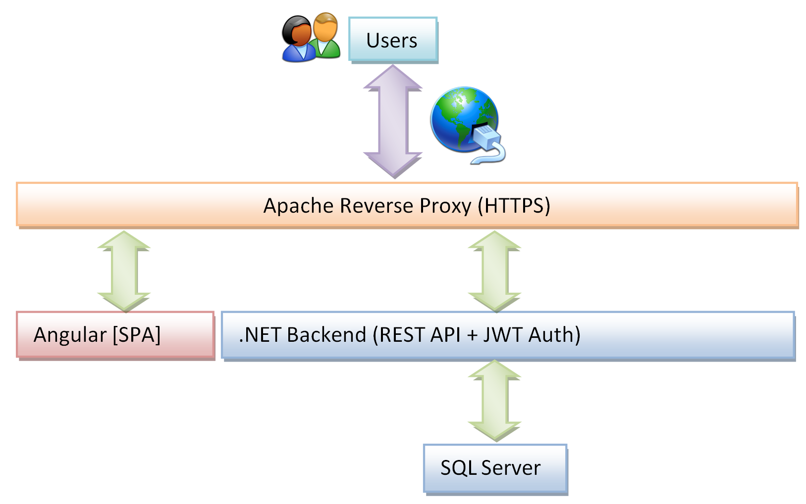
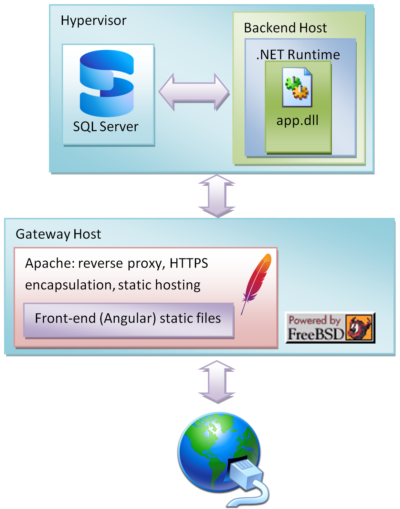
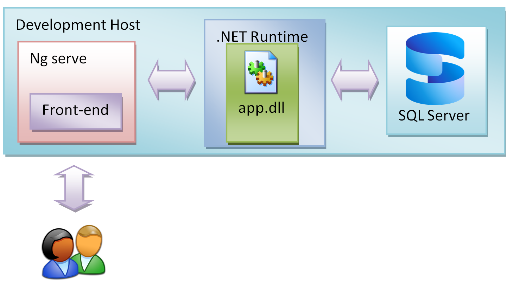

# Extensible SaaS CRM with WebAssembly-based multi-tenant logic

The solution is split in front and back-end part. Front-end developed with Angular is a collecton of static HTML files with JavaScript. Back-end is a .NET-developed application. You should be able to see a diagram showing interaction of users with this system.

# Demo

<!--[https://autocv.mrozektech.com](https://autocv.mrozektech.com)-->

Test account: string / string

# Why did you build it?
I built it to solve challenges of AI-influenced job market, where people use AI to generate job ads, and applicants use AI to apply.

The program:

1. Scrapes web for jobhunt (homepages of favorite companies)
2. Translates ads and cover letters to human readable language
3. Shows correlation between different job ads and candidates.

# What real-world problem does it simulate?
The problem is that everything recruiters get nowadays is AI fluff.

# What makes it different from a normal CRUD app?

Functionality: translate job description etc, technically, it uses WebAssembly to enable secure code execution for different tenants to upload their custom matching logic.

# How to run

Requirements: .NET SDK, Node.js + Angular CLI, SQL Server.

Backend: git clone, dotnet restore, dotnet run.

Frontend: git clone, npm install, ng serve.

Database: Set connection string and launch migration.

# Authorization
Everything on JWT tokens. You need to log in do do anything.

# Screenshots

TBA

<!--Wrzuc tu fotki dashboardu, profilu kandydata i tego, jak system dopasowuje ludzi do pracy.-->

## Production setup

* Angular app is served by Apache.
* Apache proxies /api/ to an internal backend.
* Back-end and SQL server run on virtual machines.
* Back-end requres a valid environment variable to connect to a database.

## Development setup

* Angular runs with ng serve
* Backend runs locally at http://localhost:5000
* Angular calls http://localhost:5000/api/ for requests.
* Backend requires a valid environment variable to connect to a database.

<!--
2) Architecture clarity (critical for senior signal)

I need:

Backend
Is it monolith or modular monolith?
Any DDD patterns?
How is Clean Architecture split exactly?
Frontend
State management? (if any)
API communication style?
Plugin system
How WASM is executed (host, runtime, library?)
Isolation model (sandbox, process, in-memory?)
⚙️ 3) “Hard engineering parts”

This is what makes your project impressive:

What was the hardest technical problem?
What broke at least once?
What took the longest time?

Examples:

JWT/auth complexity
WASM execution safety
Deployment/networking issues
Cross-origin / reverse proxy issues
🧩 4) Feature completeness map

List features like this:

Core features
CRUD for X, Y, Z
Advanced features
Matching system
Plugin system
Role-based access? (if exists)
Nice-to-have / partial
Tests
Logging
Validation
🌐 5) Deployment & infra (VERY important for your project)

I need details like:

How many VMs?
What runs where?
How requests flow (step-by-step)
Why Apache instead of Nginx/IIS?
Any firewall / networking setup worth mentioning?

👉 This is where your project becomes “serious engineering”

🔐 6) Security model (often missing in portfolios)
How is JWT stored?
How is auth validated?
Any protection against:
invalid tokens
plugin abuse (WASM sandbox)

Even basic answers help a lot.

🧪 7) Testing strategy
What is tested?
Unit vs integration?
What is mocked (you mentioned Moq—what exactly)? Moq tests 
📊 8) What YOU want to be hired for

Backend .NET roles?
Full-stack?
Cloud / DevOps?
Architecture / senior backend?

👉 This changes how I frame your project.

🎯 9) Optional but powerful

If you have:

screenshots
architecture sketches
repo structure tree
API examples
🚀 If you want the best possible output

Send me this filled template:

1. System story:
2. Architecture (backend/frontend/plugin):
3. Hardest challenges:
4. Features:
5. Deployment setup:
6. Security:
7. Testing:
8. Target job role:
💡 What I will then give you
-->

# Design

The system is designed with somewhat simplified clean architecture. It is divided into the following directory structure

## Controllers

Controllers (a reminiscence from [MVC-model](https://en.wikipedia.org/wiki/Model-view-controller)) contains files dealing with HTTP requests. These requests are filtered (if necessary). Each request is sent to an appropriate service.

## Domain

## DTOs

Data Transfer Objects contain objects used to transfer data between modules. This directory is also used by Entity Framework to materialize the database.

## Infrastructure

Contains infrastructure-critical code.

## Migrations

## Services

Contains logic of each component in the system. 

### Auth service

Contains authentication code.

### Case service

Contains logic related to errand management (or case management in other words). It allows you to create, update and delete cases.

### Cover Letter service

Contains logic useful for auto-generating cover letters. It allows to create, update, delete cover letters. Additionally, it provides functions for calling AI for auto-generating these documents.

### CV service

Contains logic useful for managing and auto-generating CVs. It allows to create, update, delete CVs. It provides functionality to call AI to auto-generate some pieces of text.

### Job Ad Service

The Job Ad service retrieves and allows to manage available job ads. There are external services, which import data to the database.

The service aims at collecting a large database of offers, so that candidates can be matched with existing assignments.

## Other files

* Authentication using JWT (login/logout/register)
* Some tests with MOQ
* REST API
* Clean Architecture

# Backend structure

* Controllers
* Domain
* DTOs
* Infrastructure
* Services

# Authentication

<!-- 13:33 Sunday, 8 March 2026

I thik that generally it is easier to run and deploy a system using something I already am familiar with, and then, when everything is ready move to Docker.

Therefore I will deploy my database on good old Windows Server. I think there is something magical about this legacy system. There are: control panel applets (cpl), there is WMC (Windows Management Console), you can run legacy paint, and there are services. This is nostalgic. 

Let's deploy our secrets to environment variables on Windows Server, so we don't have them in source code we will push to git using this PowerShell script: -->

* JWT-based Authentication
* Environment variable used for secret key

	[Environment]::SetEnvironmentVariable(
	"JWT_SECRET",
	"your-very-long-secret-key",
	"Machine"
	)
	
Note: JWT secret must be sufficiently long to meet security requirements.

# Testing

* Unit tests developed with MOQ
* DTO simplifies mocking and testing

# Deployment

This application is hosted on a self-managed on-premise environment. It is available publicly, so that you can click around.

This system was originally developed on Windows Server due to ubiquitous nature of this solution. More deployments should be done with Linux and Docker in the future.

<!--
17:18 Sunday, 8 March 2026

Note that we can easily test our project using MOQ. The reason is that we have DTO objects, so it is very easy to predict database structure for MOQ.

This is production-ready, follows clean architecture, respects JWT auth, and integrates neatly with your EF Core setup.

<!-- Magnus: Do you ever use builder pattern used commonly in very large projects?

Many junior developers expose public setters everywhere and create mutable chaos.
In modern .NET (especially EF Core), many teams use:
init;
instead of set.
Example:
public string Title { get; init; }
Which allows:
new CVProfile { Title = "Test CV" }
but only during object creation.

# Backend structure

* Controllers
* Domain
* DTOs
* Infrastructure
* Services

I want to add a new service or microservice as separate project.

public class CoverLetter : BaseEntity
{
    public Guid UserId { get; private set; }
    public string Title { get; private set; }
    public string Content { get; private set; }
    public bool IsAIGenerated { get; private set; }
    public string? AICustomPrompt { get; private set; }

public class JobAd : BaseEntity
{
    public Guid UserId { get; private set; }
    public string Title { get; private set; }
    public string Description { get; private set; }
    public string CompanyName { get; private set; }
    public string Location { get; private set; }
    public string SalaryRange { get; private set; }
    public bool IsActive { get; private set; }

public class JobApplication : BaseEntity
{
    public Guid UserId { get; private set; }
    public Guid JobAdId { get; private set; }
    public Guid CVProfileId { get; private set; }
    public Guid CoverLetterId { get; private set; }
    public JobApplicationStatus Status { get; set; }

 -->
<!--
 THE PLAN:
 
 1. Blog post + Linkedin Visibility (advertising):
 
 “From CRUD to Extensible System: Building a WebAssembly-powered CRM”
 
 2. Talk on .NET Skane
 
 -->